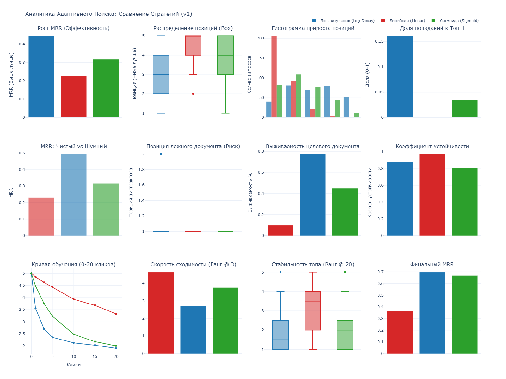

# 🧠 Adaptive Semantic Search Engine


> **Курсовой проект**: Интеграция методов семантического поиска и статистического ранжирования в архитектуру реляционной СУБД PostgreSQL

---

### 👨‍🎓 Информация о проекте

* **Авторы:** Смирнов Никита ([@pyramidheadshark](https://github.com/pyramidheadshark)), Кирилл Мельников ([@Chaberis](https://github.com/Chaberis))
* **Университет:** РТУ МИРЭА, 3 курс
* **Дисциплина:** Программные средства манипулирования данными

---

## 📖 Суть проблемы и решение

Классический векторный поиск (Vector Search / Cosine Similarity) статичен. Он выдает результаты только на основе семантической близости текста. Если модель считает документ релевантным, он будет в топе всегда, даже если пользователи считают иначе.

Этот проект реализует **Динамическое Ре-ранжирование (Dynamic Re-ranking)**. Система "слушает" клики пользователей и корректирует веса документов в реальном времени, используя гибридную формулу ранжирования.

### 📊 Результаты бенчмарков

Ниже представлен анализ эффективности алгоритмов ранжирования (Linear vs Log-Decay vs Sigmoid), полученный в ходе симуляции на датасете NFCorpus.



**Ключевой вывод:** Стратегия **Log-Decay** (Логарифмическое затухание) показала наилучший результат, обеспечивая быстрый рост релевантности (MRR) без риска переобучения и накрутки.

---

## 🛠 Технический стек

* **Core:** Python 3.11, FastAPI
* **Database:** PostgreSQL 16 + `pgvector`
* **ML:** `sentence-transformers` (модель `all-MiniLM-L6-v2`)
* **Analytics:** Pandas, Plotly
* **Infrastructure:** Docker Compose, uv

---

## 🚀 Установка и запуск

### Требования

* Docker & Docker Compose
* Токен HuggingFace (для скачивания датасета)

### Пошаговая инструкция

1. **Настройка окружения:**
    Создайте файл `.env` и добавьте ваш токен:

    ```bash
    cp .env.example .env
    # Впишите HF_TOKEN=... внутри .env
    ```

2. **Запуск контейнеров:**

    ```bash
    make build
    make up
    ```

    *При первом запуске будет скачана ML-модель.*

3. **Загрузка данных (ETL):**
    Скрипт скачает датасет NFCorpus, векторизует его и сохранит в Postgres.

    ```bash
    make load
    ```

4. **Проверка работы API:**

    ```bash
    curl -X POST "http://localhost:8000/api/v1/search" \
         -H "Content-Type: application/json" \
         -d '{"query": "vitamin c benefits", "limit": 3}'
    ```

---

## 🧪 Воспроизведение исследования

Проект включает модуль симуляции, который эмулирует поведение пользователей (клики, шум, ошибки) и сравнивает математические стратегии.

1. **Запустить бенчмарк (3 сценария: эффективность, шум, насыщение):**

    ```bash
    docker compose exec app python -m src.scripts.benchmark
    ```

2. **Сгенерировать HTML-отчет:**

    ```bash
    docker compose exec app python -m src.scripts.visualize
    ```

3. **Результат:** Откройте файл `data/final_advanced_dashboard_ru.html`.

---

## 📂 Структура проекта

* `src/database.py` — Схемы данных (`Document`, `Interaction`) и подключение к БД
* `src/search.py` — Ядро логики: математические формулы ре-ранжирования
* `src/ml.py` — Инициализация ML-модели.
* `src/main.py` — API роуты и конфигурация
* `src/scripts/` — Скрипты ETL и аналитики

---

## ✅ Тестирование

Запуск интеграционных тестов (проверка Feedback Loop):

```bash
make test
```
